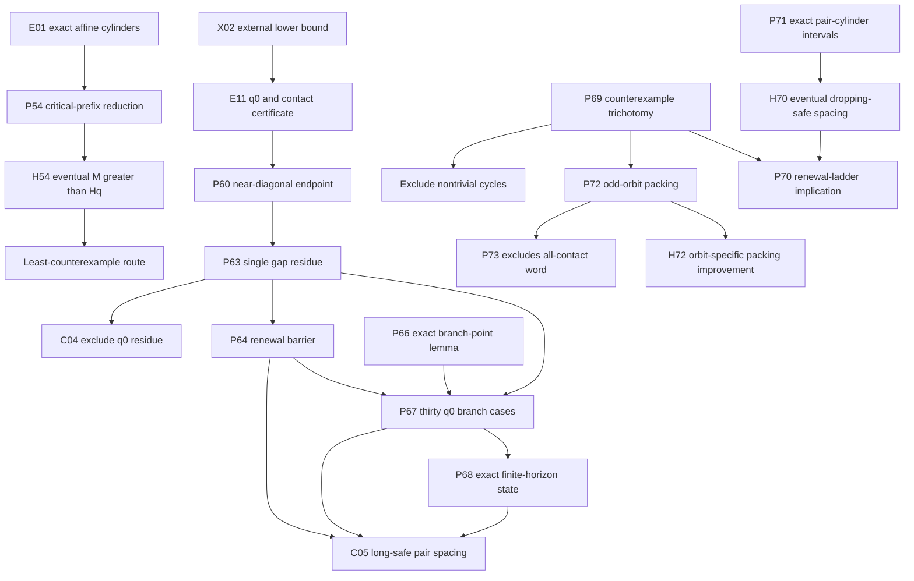

# AI research guide

This is the operational entry point for an AI agent continuing the repository.
The Collatz conjecture remains `OPEN`; no finite search in this repository is a
proof of the conjecture. Phase 12's infinite-safe-tail odd-orbit packing is the
latest research layer.

## Read in this order

1. [`STATUS.md`](STATUS.md) — current mathematical state.
2. [`CLAIMS_LEDGER.md`](CLAIMS_LEDGER.md) — exact claim labels and dependencies.
3. [`ROADMAP.md`](ROADMAP.md) — prioritized proof obligations and fast
   falsification tests.
4. [`FAILED_APPROACHES.md`](FAILED_APPROACHES.md) — shortcuts not to rediscover.
5. [`../PHASE12_RUN_RESULTS.md`](../PHASE12_RUN_RESULTS.md), after its input
   [`../PHASE11_RUN_RESULTS.md`](../PHASE11_RUN_RESULTS.md) and the earlier
   inputs
   [`../PHASE10_RUN_RESULTS.md`](../PHASE10_RUN_RESULTS.md),
   [`../BRANCH_POINT_RUN_RESULTS.md`](../BRANCH_POINT_RUN_RESULTS.md), and
   [`../TWO_TAIL_RUN_RESULTS.md`](../TWO_TAIL_RUN_RESULTS.md).
6. [`../AGENTS.md`](../AGENTS.md) — mandatory exact-arithmetic and proof-claim
   protocol.

Run this before changing research code:

```bash
.venv/bin/python scripts/research_health.py
```

It checks navigation freshness, claim-label uniqueness, tracked artifact
hashes, active claim statuses, and the latest supplemental verifier boundary.

## Current dependency map



Arrows mean “is an input to,” not “has been proved unconditionally.” X02 is
external evidence; P54, P60, P63, P64, and P67 are conditional. P68 is an
unconditional finite-horizon theorem. P69--P71 are unconditional reductions or
finite-cylinder arithmetic. P72 and P73 are unconditional constraints on the
infinite-safe-tail branch, while H70 and H72 are open. C04, C05, H54, every
uneliminated P69 branch, and the Collatz conjecture remain open.

## Active proof obligations

| ID | Status | Exact missing step | Fastest useful next test |
|---|---|---|---|
| H54 | `OPEN` | Prove `M(K_q-1)>H_q` eventually | Attack any proposed `M(k)` inequality with all stored record failures and mandatory adversarial families |
| H70 | `OPEN` | Prove the eventual dropping-safe pair spacing used by P70 | Reproduce the six E18 failures; reject height-free rules with NG20 and every lossy merge with NG19 |
| H72 | `OPEN` | Strengthen P72 using actual odd-orbit transitions until infinite coefficient-safe tails are impossible | Reject mod-6-only improvements with NG21; test multi-step congruence exclusions on E20 and all mandatory families |
| C04 | `OPEN` | Exclude `rho=[B*3^(-q0)]_D` from the q0 near box | Preserve affine constant, carries, and both canonical residue ranges |
| C05 | `OPEN` | Prove `Delta_(K0-1)(2^72)>W` | For its weaker q0-specific consequence, use the 30 branch cases; reject any state that forgets inherited surplus or either tail residue |
| C03 | `OPEN` | Rank arbitrary contracting `{A,B}*` interleavings | Test BBA and all near-critical `A^rB^s` records first |

The current best direct target is not a larger raw enumeration. It is a sound
cross-cylinder merge extending P71's exact per-cylinder interval state

```text
(h, a, odd normalized gap, inherited coefficient surplus,
 left tail residue state, right tail residue state).
```

NG19 supplies exact safe/non-safe collisions for every fixed shortening
`y mod 2^b`, `b<12`; NG20 supplies a universal height-free gap-4 pair. Any
next prototype must preserve ordinary height and either separate those
histories, retain equivalent carry information, or prove a sound dominance
rule before scaling it.

## Experiment contract

Every new experiment should state, before a large run:

1. claim ID and exact quantifiers;
2. why success would advance H54, H70, H72, C04, or C05;
3. smallest adversarial falsification range;
4. exact acceptance arithmetic;
5. logically independent reconstruction method;
6. stop criterion and artifact size policy;
7. “What this result does not prove.”

Use `VERIFIED_FINITE` for bounded profiles even when every tested row passes.
Use `CONDITIONAL` when a least-counterexample or external premise is retained.
Do not introduce a new claim ID for a renamed copy of an existing obligation.

## High-value next experiments

- Search for a quotient/carry dominance relation merging P71 cylinders while
  retaining ordinary height and explicitly separating every NG19 collision.
- Attack H70 separately from the other two P69 branches; do not describe a
  renewal-ladder result as a full counterexample exclusion.
- Attack H72 with actual successor congruences or forbidden multi-step
  constellations. Distinctness and mod-6 density alone are exponent-sharp by
  NG21.
- Derive exact lower bounds on the ordinary size of a pair of inverse-parity
  residues from their odd normalized gap and common-prefix affine constant.
- Test whether any proposed branch potential composes across the record
  witnesses at `h=2,3,6,7,10,19` before attempting q0.
- Connect the gap residue `rho` to Christoffel/rotation extremality only after
  writing the exact external theorem and the repository-specific translation
  as separate lemmas.
- Continue H54 only with a proposed asymptotic inequality, never by extending
  Phase 1–5 depth for its own sake.

## Known traps

- Contact density without endpoint residues: refuted by NG17.
- Strict spacing growth at every depth: refuted by NG18.
- A fixed dictionary of dangerous words or shadow centers: refuted by
  NG04/NG09/NG15 and `A^rB^s`.
- A fixed `b<L` tail-residue window for an L-step safety decision: refuted at
  `L=12` by NG19.
- Height-free dropping-safe spacing greater than 4: refuted for every `k>=3`
  by NG20.
- A packing exponent below `1/9` from distinctness and coprimality modulo six
  alone: refuted by NG21's abstract saturator, which is not a Collatz orbit.
- Treating finite disappearance of safe pairs below a bound as a larger-H
  spacing theorem.
- Treating formal rational cycles as positive integral Collatz cycles.
- Treating separate source files as proof of logical independence.

## Completion checklist

Before handing off a meaningful result:

```bash
.venv/bin/python -m pytest -q
.venv/bin/python scripts/research_health.py
.venv/bin/python scripts/hash_artifacts.py artifacts \
  --write artifacts/SHA256SUMS
git diff --check
```

Update `STATUS`, `CLAIMS_LEDGER`, `RESEARCH_HISTORY`, `FAILED_APPROACHES`,
`ROADMAP`, `HANDOFF`, and the relevant result report. Preserve every old
counterexample and keep `proves_collatz=false` unless the emergency proof audit
has actually completed.
