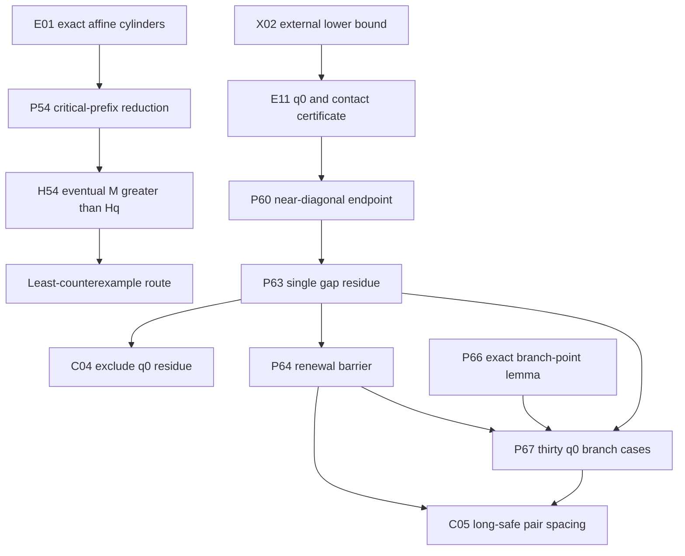

# AI research guide

This is the operational entry point for an AI agent continuing the repository.
The Collatz conjecture remains `OPEN`; no finite search in this repository is a
proof of the conjecture. Phase 10 and its branch-point supplement are the
latest research layer.

## Read in this order

1. [`STATUS.md`](STATUS.md) — current mathematical state.
2. [`CLAIMS_LEDGER.md`](CLAIMS_LEDGER.md) — exact claim labels and dependencies.
3. [`ROADMAP.md`](ROADMAP.md) — prioritized proof obligations and fast
   falsification tests.
4. [`FAILED_APPROACHES.md`](FAILED_APPROACHES.md) — shortcuts not to rediscover.
5. [`../PHASE10_RUN_RESULTS.md`](../PHASE10_RUN_RESULTS.md) and
   [`../BRANCH_POINT_RUN_RESULTS.md`](../BRANCH_POINT_RUN_RESULTS.md) — latest
   accepted computations and obstruction.
6. [`../AGENTS.md`](../AGENTS.md) — mandatory exact-arithmetic and proof-claim
   protocol.

Run this before changing research code:

```bash
.venv/bin/python scripts/research_health.py
```

It checks navigation freshness, claim-label uniqueness, tracked artifact
hashes, active claim statuses, and the latest supplemental verifier boundary.

## Current dependency map



Arrows mean “is an input to,” not “has been proved unconditionally.” X02 is
external evidence; P54, P60, P63, P64, and P67 are conditional. C04, C05,
H54, and the Collatz conjecture remain open.

## Active proof obligations

| ID | Status | Exact missing step | Fastest useful next test |
|---|---|---|---|
| H54 | `OPEN` | Prove `M(K_q-1)>H_q` eventually | Attack any proposed `M(k)` inequality with all stored record failures and mandatory adversarial families |
| C04 | `OPEN` | Exclude `rho=[B*3^(-q0)]_D` from the q0 near box | Preserve affine constant, carries, and both canonical residue ranges |
| C05 | `OPEN` | Prove `Delta_(K0-1)(2^72)>W` | For its weaker q0-specific consequence, use the 30 branch cases; reject any state that forgets inherited surplus or either tail residue |
| C03 | `OPEN` | Rank arbitrary contracting `{A,B}*` interleavings | Test BBA and all near-critical `A^rB^s` records first |

The current best direct target is not a larger raw enumeration. It is a
lossless continuation certificate for a branch state of the form

```text
(h, a, odd normalized gap, inherited coefficient surplus,
 left tail residue state, right tail residue state).
```

The first prototype should be small enough for an independent verifier to
exhaust every transition. Search for two histories with the same proposed
compressed state but different continuation behavior before scaling it.

## Experiment contract

Every new experiment should state, before a large run:

1. claim ID and exact quantifiers;
2. why success would advance H54, C04, or C05;
3. smallest adversarial falsification range;
4. exact acceptance arithmetic;
5. logically independent reconstruction method;
6. stop criterion and artifact size policy;
7. “What this result does not prove.”

Use `VERIFIED_FINITE` for bounded profiles even when every tested row passes.
Use `CONDITIONAL` when a least-counterexample or external premise is retained.
Do not introduce a new claim ID for a renamed copy of an existing obligation.

## High-value next experiments

- Build a two-tail continuation automaton for branch depths `2<=h<=31` that
  retains coefficient surplus exactly; falsify state compression at small H.
- Derive exact lower bounds on the ordinary size of a pair of inverse-parity
  residues from their odd normalized gap and common-prefix affine constant.
- Test whether any proposed branch potential composes across the record
  witnesses at `h=2,3,6,7,10,19` before attempting q0.
- Connect the gap residue `rho` to Christoffel/rotation extremality only after
  writing the exact external theorem and the repository-specific translation
  as separate lemmas.
- Continue H54 only with a proposed asymptotic inequality, never by extending
  Phase 1–5 depth for its own sake.

## Known traps

- Contact density without endpoint residues: refuted by NG17.
- Strict spacing growth at every depth: refuted by NG18.
- A fixed dictionary of dangerous words or shadow centers: refuted by
  NG04/NG09/NG15 and `A^rB^s`.
- Treating finite disappearance of safe pairs below a bound as a larger-H
  spacing theorem.
- Treating formal rational cycles as positive integral Collatz cycles.
- Treating separate source files as proof of logical independence.

## Completion checklist

Before handing off a meaningful result:

```bash
.venv/bin/python -m pytest -q
.venv/bin/python scripts/research_health.py
.venv/bin/python scripts/hash_artifacts.py artifacts \
  --write artifacts/SHA256SUMS
git diff --check
```

Update `STATUS`, `CLAIMS_LEDGER`, `RESEARCH_HISTORY`, `FAILED_APPROACHES`,
`ROADMAP`, `HANDOFF`, and the relevant result report. Preserve every old
counterexample and keep `proves_collatz=false` unless the emergency proof audit
has actually completed.
