# AI research guide

This is the operational entry point for an AI agent continuing the repository.
The Collatz conjecture remains `OPEN`; no finite search in this repository is a
proof of the conjecture. Phase 16's critical dichotomy is the latest research
layer.

## Read in this order

1. [`RESEARCH_SYNTHESIS.md`](RESEARCH_SYNTHESIS.md) — conventions, global
   branch map, Phase 1–16 evidence boundaries, and current obligations.
2. [`STATUS.md`](STATUS.md) — current mathematical state.
3. [`CLAIMS_LEDGER.md`](CLAIMS_LEDGER.md) — exact claim labels and dependencies.
4. [`ROADMAP.md`](ROADMAP.md) — prioritized proof obligations and fast
   falsification tests.
5. [`FAILED_APPROACHES.md`](FAILED_APPROACHES.md) — shortcuts not to rediscover.
6. [`../PHASE16_RUN_RESULTS.md`](../PHASE16_RUN_RESULTS.md), then its inputs:
   [`../PHASE15B_RUN_RESULTS.md`](../PHASE15B_RUN_RESULTS.md),
   [`../PHASE15_RUN_RESULTS.md`](../PHASE15_RUN_RESULTS.md),
   [`../PHASE14_RUN_RESULTS.md`](../PHASE14_RUN_RESULTS.md),
   [`../PHASE13_RUN_RESULTS.md`](../PHASE13_RUN_RESULTS.md),
   [`../PHASE12_RUN_RESULTS.md`](../PHASE12_RUN_RESULTS.md), the accompanying
   [`../research/audits/garcia-tal-phase12/REPORT.md`](../research/audits/garcia-tal-phase12/REPORT.md),
   [`../PHASE11_RUN_RESULTS.md`](../PHASE11_RUN_RESULTS.md), and the earlier
   inputs
   [`../PHASE10_RUN_RESULTS.md`](../PHASE10_RUN_RESULTS.md),
   [`../BRANCH_POINT_RUN_RESULTS.md`](../BRANCH_POINT_RUN_RESULTS.md), and
   [`../TWO_TAIL_RUN_RESULTS.md`](../TWO_TAIL_RUN_RESULTS.md).
7. [`../AGENTS.md`](../AGENTS.md) — mandatory exact-arithmetic and proof-claim
   protocol.

Run this before changing research code:

```bash
.venv/bin/python scripts/research_health.py
```

It checks navigation freshness, public Markdown links/private paths,
claim-label uniqueness, tracked artifact hashes, active claim statuses, and
the latest supplemental verifier boundary.
From a clean acceptance worktree use `--strict`; this additionally rejects
untracked files under `artifacts/`. Existing local exploratory files are
reported as warnings in non-strict mode so they are not silently confused with
manifested evidence.

Machine-readable entry points are in [`../research/registry.json`](../research/registry.json)
and [`../research/README.md`](../research/README.md). The registry is checked
against the claims ledger and points to scoped context packs for H54, H70, and
H72. `research/claims-index.json` is regenerated from the ledger for efficient
AI lookup; it is not edited independently. The registry is an operational
index, not a duplicate theorem source.

## Current dependency map

```mermaid
flowchart TD
    E01["E01 exact affine cylinders"] --> P54["P54 critical-prefix reduction"]
    P54 --> H54["H54 eventual M greater than Hq"]
    H54 --> Goal["Least-counterexample route"]

    X02["X02 external lower bound"] --> E11["E11 q0 and contact certificate"]
    E11 --> P60["P60 near-diagonal endpoint"]
    P60 --> P63["P63 single gap residue"]
    P63 --> C04["C04 exclude q0 residue"]
    P63 --> P64["P64 renewal barrier"]
    P64 --> C05["C05 long-safe pair spacing"]
    P66["P66 exact branch-point lemma"] --> P67["P67 thirty q0 branch cases"]
    P63 --> P67
    P64 --> P67
    P67 --> C05
    P67 --> P68["P68 exact finite-horizon state"]
    P68 --> C05

    P69["P69 counterexample trichotomy"] --> Cycle["Exclude nontrivial cycles"]
    P69 --> P72["P72 odd-orbit packing"]
    P72 --> P73["P73 excludes all-contact word"]
    EXT07["EXT07 external interval sparsity"] --> P74["P74 permanent-safe reduction"]
    P74 --> P75["P75 summable defect strengthening"]
    P72 --> P75
    P75 --> H72["H72 positivity or height obstruction"]
    P76["P76 real and 2-adic shadows"] --> H72
    P77["P77 renewal prefix code"] --> P78["P78 pressure bounds"]
    P78 --> P80["P80 conditional anti-concentration"]
    P79["P79 threshold and valuation transfer"] --> P80
    P80 --> H72
    P81["P81 exact coalescent rewrite"] --> P82["P82 least-source irreducibility"]
    P82 --> H72
    P83["P83 run-sensitive thresholds"] --> H72
    P84["P84 block decrement"] --> H72
    P85["P85 eventual shadow height"] --> H72
    P86["P86 cross-Q surplus dominance"] --> H72
    P87["P87 strict-valley suffix"] --> P86
    P88["P88 gap-{1,2} injectivity"] --> H72
    P89["P89 ancestral minimality"] --> H89["H89 eventual Mstar barrier"]
    P91["P91 cross-Q prefix carry"] --> H89
    P92["P92 uniform cylinder dominance"] --> H89
    P95["P95 shifted jump class"] --> H89
    H89 --> P90["P90 repaired two-case implication"]
    P90 --> Goal
    P96["P96 3-adic endpoint measure"] --> H72
    NG25["NG25 same-Q incompleteness"] --> H72
    NG26["NG26 unsafe-target witness"] --> H72
    NG27["NG27 gain-four witness"] --> H89
    P97["P97 signed carry bounds"] --> H89
    P98["P98 same-Q geodesic criterion"] --> H97["H97 exclude G250"]
    P101["P101 250 dichotomy"] --> H97
    P101 --> H98["H98 exclude H250"]
    NG28["NG28 negative carry"] --> H89
    NG24["NG24 left-congruence failure"] --> H72
    NG23["NG23 raw Haar failure"] --> H72
    NG22["NG22 formal 2-adic obstruction"] --> H72
    P69 --> P70["P70 renewal-ladder implication"]
    H70["H70 eventual dropping-safe spacing"] --> P70
    P71["P71 exact pair-cylinder intervals"] --> H70
```



Arrows mean “is an input to,” not “has been proved unconditionally.” X02 is
external evidence; P54, P60, P63, P64, and P67 are conditional. P68 is an
unconditional finite-horizon theorem. P69--P73 and P76 are internal theorems
or exact reductions. EXT07 is external; P74/P75 are conditional on it.
P77--P79, P81--P89, P91--P102 are exact renewal/ancestral/critical theorems;
P80, P90, and P103 are conditional implications.
NG22 is a formal/2-adic countermodel, NG23 is a raw-volume failure, NG24 is a
left-congruence failure, and NG25--NG28 delimit the finite ancestral search
language. H54, H70, H72, H89, H97, H98, C04, C05, every uneliminated P69 branch,
and the Collatz conjecture remain open.

## Active proof obligations

| ID | Status | Exact missing step | Fastest useful next test |
|---|---|---|---|
| H54 | `OPEN` | Prove `M(K_q-1)>H_q` eventually | Attack any proposed `M(k)` inequality with all stored record failures and mandatory adversarial families |
| H89 | `OPEN` | Prove `M_star(K_q-1)>H_q` eventually and certify the finite first-crossing remainder | Preserve signed P91/P97 carry and reject NG27/NG28 before extending E25--E27 |
| H97 | `OPEN` | Exclude every positive ordinary-source all-prefix same-Q geodesic G250 word | Retain fixed positive source and contact/carry state; reject contact-only/all-contact shortcuts with NG17/P73/NG28 |
| H98 | `OPEN` | Empty the H250 box `N<q/250`, `X<q/125`, `Z<2q/125` | Use a two-sided exact state and keep the periodic branch separate; test NG19 and NG24--NG28 |
| H70 | `OPEN` | Prove the eventual dropping-safe pair spacing used by P70 | Reproduce the six E18 failures; reject height-free rules with NG20 and every lossy merge with NG19 |
| H72 | `OPEN` | Prove one of P80's ordinary canonical-residue bounds, eventual P86 surplus reducibility, or an equivalent positivity/height obstruction extending P72/P75--P96 | Reject mod-6-only improvements with NG21, analytic/2-adic-only contradictions with NG22, raw Haar substitution with NG23/P96, prefix-closed endpoint states with NG24, and same-Q/safe-target/bounded-gain restrictions with NG25--NG27; test on E20/E22--E26, the `{1,2}` core, and all mandatory families |
| C04 | `OPEN` | Exclude `rho=[B*3^(-q0)]_D` from the q0 near box | Preserve affine constant, carries, and both canonical residue ranges |
| C05 | `OPEN` | Prove `Delta_(K0-1)(2^72)>W` | For its weaker q0-specific consequence, use the 30 branch cases; reject any state that forgets inherited surplus or either tail residue |
| C03 | `OPEN` | Rank arbitrary contracting `{A,B}*` interleavings | Test BBA and all near-critical `A^rB^s` records first |

The current best direct target is not a larger raw enumeration. It is a sound
cross-cylinder merge extending P71's exact per-cylinder interval state

```text
(h, a, odd normalized gap, inherited coefficient surplus,
 left tail residue state, right tail residue state).
```

NG19 supplies exact safe/non-safe collisions for every fixed shortening
`y mod 2^b`, `b<12`; NG20 supplies a universal height-free gap-4 pair. Any
next prototype must preserve ordinary height and either separate those
histories, retain equivalent carry information, or prove a sound dominance
rule before scaling it.

## Experiment contract

Every new experiment should state, before a large run:

1. claim ID and exact quantifiers;
2. why success would advance H54, H70, H72, C04, or C05;
3. smallest adversarial falsification range;
4. exact acceptance arithmetic;
5. logically independent reconstruction method;
6. stop criterion and artifact size policy;
7. “What this result does not prove.”

Record these fields in `research/experiments/<experiment-id>.json` using
`research/schemas/experiment.schema.json`. An accepted manifest must name all
artifacts and preserve the recorded manifest hash. Phase 16 provides the
reference accepted example.

Use `VERIFIED_FINITE` for bounded profiles even when every tested row passes.
Use `CONDITIONAL` when a least-counterexample or external premise is retained.
Do not introduce a new claim ID for a renamed copy of an existing obligation.

## High-value next experiments

- Search for a quotient/carry dominance relation merging P71 cylinders while
  retaining ordinary height and explicitly separating every NG19 collision.
- Attack H70 separately from the other two P69 branches; do not describe a
  renewal-ladder result as a full counterexample exclusion.
- Attack H72 through positive ordinary-integrality, effective reduced
  shadow-height/gcd, P79's valuation-conditioned successor congruences, or a
  P86 cross-Q surplus state retaining the carries lost in NG24.
  Mod-6 density is blocked by NG21, analytic/general-2-adic coherence by NG22,
  raw local-volume counting by NG23, and endpoint-only prefix propagation by
  NG24; same-Q or safe-target-only pruning is blocked by NG25/NG26, and
  bounded same-Q gain by NG27 and positive carry by NG28.
- Attack H97 and H98 as separate obligations. A proof of one branch does not
  close P101, and neither branch applies to repeated periodic values.
- Attack H89 only with a proposed all-depth P91/P92/P95/P97 recurrence. E25's
  `M_star(210)>5000000` and P96's 3-adic complement are not asymptotic or
  pointwise substitutes.
- Derive exact lower bounds on the ordinary size of a pair of inverse-parity
  residues from their odd normalized gap and common-prefix affine constant.
- Test whether any proposed branch potential composes across the record
  witnesses at `h=2,3,6,7,10,19` before attempting q0.
- Connect the gap residue `rho` to Christoffel/rotation extremality only after
  writing the exact external theorem and the repository-specific translation
  as separate lemmas.
- Continue H54 only with a proposed asymptotic inequality, never by extending
  Phase 1–5 depth for its own sake.

## Known traps

- Contact density without endpoint residues: refuted by NG17.
- Strict spacing growth at every depth: refuted by NG18.
- A fixed dictionary of dangerous words or shadow centers: refuted by
  NG04/NG09/NG15 and `A^rB^s`.
- A fixed `b<L` tail-residue window for an L-step safety decision: refuted at
  `L=12` by NG19.
- Height-free dropping-safe spacing greater than 4: refuted for every `k>=3`
  by NG20.
- Contradiction from only summable octave defects, `h_j>1`, divergent
  companion reciprocals, and an odd 2-adic source: refuted by NG22.
- Coalescent endpoint equivalence as a two-sided concatenation congruence:
  refuted by NG24; only common right suffixes preserve it.
- A packing exponent below `1/9` from distinctness and coprimality modulo six
  alone: refuted by NG21's abstract saturator, which is not a Collatz orbit.
- Replacing deterministic least positive representatives by Haar cylinder
  volume or discarding one lattice error per address: refuted by NG23.
- Positive same-Q carry: refuted by NG28 at Q=26 even though every pair through
  E27's Q=17 cutoff is positive.
- Treating finite disappearance of safe pairs below a bound as a larger-H
  spacing theorem.
- Treating formal rational cycles as positive integral Collatz cycles.
- Treating separate source files as proof of logical independence.

## Completion checklist

Before handing off a meaningful result:

```bash
.venv/bin/python -m pytest -q
.venv/bin/python scripts/build_claim_index.py --check
.venv/bin/python scripts/check_markdown_links.py
.venv/bin/python scripts/hash_artifacts.py artifacts \
  --write artifacts/SHA256SUMS
.venv/bin/python scripts/research_health.py --strict
git diff --check
```

Update `STATUS`, `CLAIMS_LEDGER`, `RESEARCH_HISTORY`, `FAILED_APPROACHES`,
`ROADMAP`, `HANDOFF`, and the relevant result report. Preserve every old
counterexample and keep `proves_collatz=false` unless the emergency proof audit
has actually completed.
