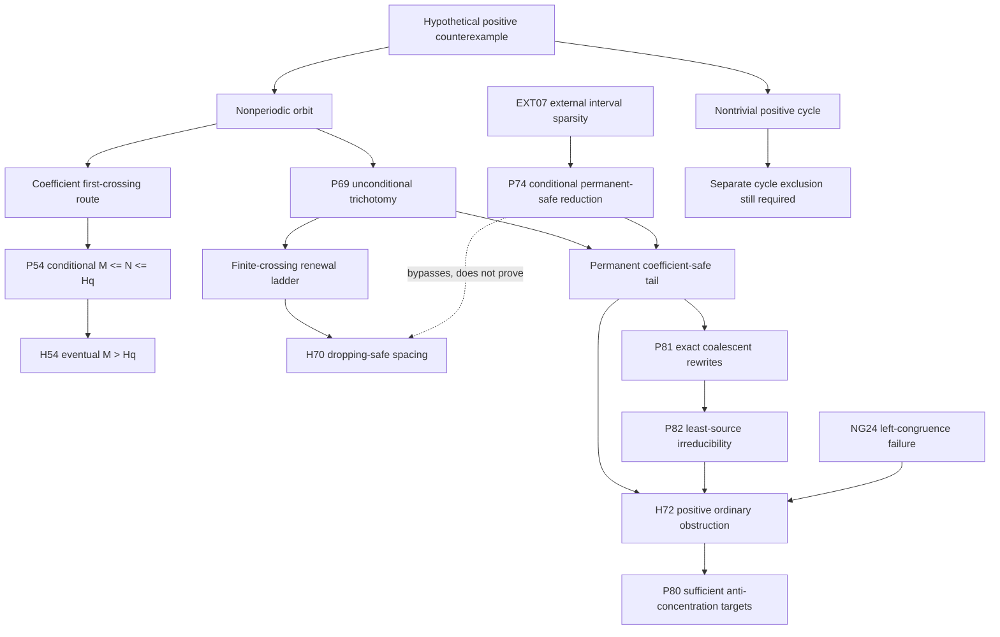

# Collatz research synthesis through Phase 15

**Audit date:** 2026-08-28

**Audited base:** `a246c97200df61030b0c6874cbf150fd9b152f0c`

**Latest accepted phase:** Phase 15

**Problem status:** `OPEN`

**`proves_collatz=false`**

This repository is an exact-arithmetic research program whose final objective
is to prove or disprove the Collatz conjecture. It has not done so. It contains
internal theorems, conditional reductions, external inputs, independently
verified finite computations, failed mechanisms, and open proof obligations.
Those categories are deliberately not interchangeable.

The canonical status of every claim is
[`CLAIMS_LEDGER.md`](CLAIMS_LEDGER.md). This synthesis is the human-readable
map connecting that ledger to the phase reports, audits, artifacts, and next
experiments. It is not a second claims ledger and does not change a claim's
status.

## 1. Evidence boundary

The repository uses this order of confidence:

1. machine-checkable certificate plus a logically separate verifier;
2. a mathematical proof written in the repository;
3. an exactly cited external theorem;
4. a reproducible exhaustive finite computation;
5. external finite evidence;
6. heuristic computation;
7. conjecture.

`VERIFIED_FINITE` never means eventual or universal. `CONDITIONAL` means every
named premise is still required. `EXTERNAL_THEOREM` is not internally
reproved. `REFUTED` applies to the exact mechanism stated in the ledger, not
automatically to every stronger variant. A formal real, rational, or 2-adic
trajectory is not a positive ordinary-integer Collatz orbit.

## 2. Map, words, and conventions

### 2.1 Full shortcut map and affine words

The repository uses the full shortcut map

\[
T(n)=
\begin{cases}
n/2,&n\equiv0\pmod2,\\
(3n+1)/2,&n\equiv1\pmod2.
\end{cases}
\]

For a start `n`, the full parity bit at time `j` is
`s_j=T^j(n) mod 2`; bit zero is the first shortcut step. For a word
`w=s_0...s_(k-1)` with `q` ones,

\[
T^k(n)=F_w(n)=\frac{3^q n+B_w}{2^k}.
\]

The affine constant is composed from left to right. Start with `B=0`; a zero
leaves `B` unchanged, while a one at position `j` replaces `B` by
`3B+2^j`. If word `b` follows word `a`, then

\[
B_{ab}=3^{q(b)}B_a+2^{|a|}B_b.
\]

A cylinder is the unique residue class modulo `2^k` realizing a fixed
length-`k` parity word. Search code may store words compactly, but proof
decisions reconstruct these integer identities.

### 2.2 Coefficient safety, dropping, and first crossing

Let `q_j` be the number of ones before time `j`. A prefix is
**coefficient-safe** through `k` when

\[
3^{q_j}\ge 2^j\qquad(1\le j\le k).
\]

Because positive powers of 2 and 3 are unequal, weak and strict inequalities
at a positive prefix have no equality case. A **coefficient first crossing**
is the first `j` with `3^{q_j}<2^j`. This concerns the multiplier only. A
start is **dropping-safe** through `k` when its actual values satisfy
`T^j(n)>=n` for `1<=j<=k`. Additive affine corrections make these different
notions.

Define

\[
M(k)=\min\{n\ge2:n\text{ is coefficient-safe through }k\}.
\]

The least-positive-counterexample convention assumes a counterexample `N`
smaller than every other positive counterexample. It is a hypothesis used in
conditional reductions, never an established object.

### 2.3 The Phase 6 barrier

For `q>=1`, let

\[
K_q=\lceil q\log_2 3\rceil,
\qquad D_q=2^{K_q}-3^q.
\]

The exact maximal affine correction is generated by

\[
B_0^{\max}=0,
\qquad
B_q^{\max}=3B_{q-1}^{\max}
 +2^{\lfloor\log_2(3^{q-1})\rfloor},
\qquad
H_q=\frac{B_q^{\max}}{D_q}.
\]

P54 states conditionally that a least positive counterexample at the named
first crossing satisfies

\[
M(K_q-1)\le N\le H_q.
\]

H54 is the open eventual opposite inequality
`M(K_q-1)>H_q`, followed by an independently checked finite remainder.

### 2.4 Odd-only exponents, defects, and contacts

For odd iterates, write

\[
x_{j+1}=\frac{3x_j+1}{2^{e_j}},
\qquad e_j=v_2(3x_j+1),
\qquad E_j=\sum_{r<j}e_r.
\]

The critical reference is `floor(j log_2 3)`. Phase 12 uses an octave defect
`a_j` and a fractional phase `theta_j` in the exact normalization

\[
x_j=2^{a_j+\theta_j}Y_j.
\]

Phase 7–9 contact variables record when the discrete defect meets its critical
boundary. The phase reports define their local indexing; they must not be
silently identified with full shortcut parity positions.

### 2.5 Renewal code and canonical residues

For a full parity sequence define

\[
\Delta_n=\#\{j<n:s_j=1\}\log3-n\log2.
\]

Under permanent safety and `Delta_n->infinity`, P77 uses successive strict
suffix minima to define forward renewal blocks `w_i`. Their reversals
`u_i=rev(w_i)` form the prefix-free first strict-upcrossing code
`mathcal U`: every proper prefix has nonpositive discrepancy and the whole
word has positive discrepancy. The reversal is essential. `mathcal U` is
prefix-free; `rev(mathcal U)` need not be.

For an address with total full length `L`, odd count `Q`, and affine constant
`B`, the canonical residues are

\[
r_2=[-B3^{-Q}]_{2^L},
\qquad
r_3=[B2^{-L}]_{3^Q}.
\]

They are least nonnegative local representatives. Their least positive
ordinary representatives are deterministic integers, not random Haar points.
Endpoint cylinders at different `Q` can be nested.

### 2.6 Legal orbits versus shadows

- A positive ordinary integer is an element of `Z_{>0}` with all prefix
  congruences and positivity satisfied simultaneously.
- A 2-adic integer may realize an infinite parity sequence without being a
  nonnegative ordinary integer.
- A formal rational cycle is the fixed orbit of an affine word over `Q`; it
  need not be integral or positive.
- The negative-real companion follows the same prescribed odd exponents but
  is not a positive Collatz orbit.
- A rational shadow may converge to one limit over `R` and another over
  `Q_2`; different topologies do not create a contradiction.

## 3. Global research map



P69 is an internal trichotomy, but it eliminates none of its branches.
Without EXT07, H70 is an independent possible way to remove the finite-crossing
ladder. If EXT07 and P74 are admitted, every nonperiodic positive orbit is
eventually permanent-safe, so H72 becomes the strategic nonperiodic target;
H70 remains open and is not proved by that bypass. A complete solution still
requires both the nonperiodic branch and the nontrivial positive-cycle branch
to be excluded.

## 4. Phase-by-phase synthesis

Each entry separates the purpose, accepted result, external input, obstruction,
and handoff. Exact counts and hashes remain in the linked phase report.

### Phases 1–2 — exact cylinders and the first frontier

- **Purpose:** encode parity cylinders, descent, splitting, and literal-orbit
  checks using exact affine arithmetic.
- **Accepted:** E01 is the affine-cylinder theorem. E02 verifies the depth-26
  certificate and all starts below `2^24` in its stated domain.
- **External input:** none for the accepted algebra and finite audit.
- **Obstacle:** 1,037,374 nodes remain `OPEN`; NG04 leaves 123,908 survivors
  outside the tested short-shadow dictionary, beginning at 27.
- **Handoff:** bounded coverage needs an unbounded mechanism, not another
  success percentage. See [`RUN_RESULTS.md`](../RUN_RESULTS.md).

### Phase 3 — mixed binary/ternary refinement

- **Purpose:** add ternary splitting and reverse merging to the binary
  frontier.
- **Accepted:** E03 reconstructs 43,198 exact reverse merges and 79,350 final
  mixed `OPEN` records; the boundary-gap audit is finite through depth 36.
- **External input:** none for the accepted finite computation.
- **Obstacle:** NG07 records supercritical unresolved growth under the tested
  refinements.
- **Handoff:** a bounded mixed modulus is not a subcritical theorem. See
  [`PHASE3_RUN_RESULTS.md`](../PHASE3_RUN_RESULTS.md).

### Phase 4 — mod-9 first returns

- **Purpose:** use the globally relevant section `2 mod 9` and exact
  first-return code.
- **Accepted:** E04 gives a prefix-free Kraft-sum-one return code, 52 templates,
  10,335 closed records, and 23,785 open records in the configured audit.
- **External input:** EXT01 (Monks et al.) supplies global section relevance;
  it is not reproved.
- **Obstacle:** NG08 records refill constants and failure of fixed horizon or
  constants-only ranking.
- **Handoff:** any rank must survive unbounded returns. See
  [`PHASE4_RUN_RESULTS.md`](../PHASE4_RUN_RESULTS.md).

### Phase 5 — mod-27 graph and dangerous cycles

- **Purpose:** classify exact first returns on the strongly sufficient
  mod-27 sections and test shadow-center rankings.
- **Accepted:** E05 classifies 52 templates, 108 labeled simple cycles, and
  four noncontracting simple words. E06 proves exact descent for the stated
  20-to-20 path class.
- **External input:** EXT01 supplies section relevance; the graph itself is
  internally enumerated.
- **Obstacle:** NG09/NG10 and the bounded H5-B survivors defeat the tested
  fixed four-center and bounded ranking mechanisms. For `A=11101`, `B=1100`,
  `AB=111011100` has map `(729x+817)/512` and fixed point `-817/217`.
  `A^rB^s` produces multipliers above one arbitrarily close to one using a
  named external irrational-rotation density theorem.
- **Handoff:** a moving-height or switch-cost invariant must retain arbitrary
  precision and interleavings. See [`PHASE5_RUN_RESULTS.md`](../PHASE5_RUN_RESULTS.md).

### Phase 6 — critical-prefix barrier

- **Purpose:** reduce a least-counterexample first crossing to `M` versus `H_q`.
- **Accepted:** P54 is a conditional symbolic implication. E08–E10 give exact
  `H_q` records, direct `M(k)` data, and certificates covering every
  `94<=q<=4960`.
- **External input:** external record minima and Wu–Wang are context only;
  certificates do not depend on them.
- **Obstacle:** H54 remains open because no eventual lower bound on the least
  positive compatible residue `M(k)` is known. A scan through `q=200000` is
  not eventual record control.
- **Handoff:** prove a carry-aware lower bound strong enough to dominate
  `H_q`. See [`PHASE6_RUN_RESULTS.md`](../PHASE6_RUN_RESULTS.md).

### Phase 7 — boundary defects and contact pressure

- **Purpose:** localize the first possible large crossing and expose its
  defect/contact structure.
- **Accepted:** exact logarithm and Stern–Brocot certificates give
  `(q0,K0)=(72057431991,114208327604)`. The 87,015-word macro alphabet and
  selected finite layers are reconstructed exactly.
- **External input:** X02 is the external computation `N>2075*2^60`; EXT04 is
  Denjoy–Koksma. The large contact counts retain both inputs.
- **Obstacle:** macro id 0 refutes contact-macro contraction, compulsory
  four-word decomposition, and local unrealizability. Finite Pareto fronts
  give no uniform inverse-residue separation.
- **Handoff:** high correction must be linked to ordinary representative
  height. See [`PHASE7_RUN_RESULTS.md`](../PHASE7_RUN_RESULTS.md).

### Phase 8 — contracting mixed blocks and octave bridge

- **Purpose:** prove descent for the ordered mixed family and convert contacts
  to first-octave short returns.
- **Accepted:** C02 proves descent for every positive integral contracting
  realization of ordered `A^rB^s`. E13 gives exact conditional first-octave
  counts. The arbitrary `{A,B}*` search is finite only.
- **External input:** C02 uses Rozier–Terracol Lemma B.1 in its large-exponent
  case. E13 additionally retains X02 and EXT04.
- **Obstacle:** no common well-founded potential is known for arbitrary
  interleavings; C03 remains open despite finite success.
- **Handoff:** test any potential first on `BBA`, macro id 0, and near-critical
  `A^rB^s`. See [`PHASE8_RUN_RESULTS.md`](../PHASE8_RUN_RESULTS.md).

### Phase 9 — two-sided criticality

- **Purpose:** combine forced contact, endpoint displacement, reverse
  coefficients, and canonical 2-adic/3-adic residues.
- **Accepted:** P59–P62 are conditional consequences of the named framework;
  E14 is finite with explicit dependencies. The endpoint is conditionally in
  a strip of width `4,142,380,786` and `7 or 19 mod 36`.
- **External input:** X02 and EXT04 remain isolated; external paradoxical-tree
  results are not reproduced.
- **Obstacle:** NG17 supplies an exact all-contact word defeating closure plus
  pressure alone. No near-diagonal canonical-residue exclusion was found;
  C04 remains open. The `q<=21` injectivity/scarcity data are finite.
- **Handoff:** retain carries, affine `B`, and both endpoint residues. See
  [`PHASE9_RUN_RESULTS.md`](../PHASE9_RUN_RESULTS.md).

### Phase 10 — gap modulus and renewal barrier

- **Purpose:** reduce the two endpoint residues to one gap and seek a long-safe
  pair contradiction.
- **Accepted:** P63 gives the exact conditional gap residue and `4|rho`; P64
  gives coefficient safety through `K0-1` on `[N,N+W]`; P65 proves a formal
  rational-cycle minimum and gcd identity.
- **External input:** P63/P64 inherit least-counterexample and X02 inputs.
  Christoffel extremality is kept separate as EXT06.
- **Obstacle:** C04 still does not determine `B mod D`. C05 was not evaluated
  at `H=2^72`; finite spacing at `H=1,500,000` is not a target certificate.
  NG18 refutes strict spacing growth at every depth.
- **Handoff:** preserve canonical representative height and pair carries. See
  [`PHASE10_RUN_RESULTS.md`](../PHASE10_RUN_RESULTS.md),
  [`BRANCH_POINT_RUN_RESULTS.md`](../BRANCH_POINT_RUN_RESULTS.md), and
  [`TWO_TAIL_RUN_RESULTS.md`](../TWO_TAIL_RUN_RESULTS.md).

### Phase 11 — counterexample trichotomy and renewal ladder

- **Purpose:** split every counterexample into exact alternatives and weaken
  C05 to a dropping-safe renewal-ladder barrier.
- **Accepted:** P69 is the trichotomy; P70 proves the H70 implication; P71
  proves affine-margin interval closure inside each fixed pair cylinder. E18
  and E19 are bounded audits.
- **External input:** none for P69–P71. EXT07 later supplies a separate
  conditional bypass, not a proof of H70.
- **Obstacle:** H70 remains open. NG19 refutes every tested shortened residue
  window at horizon 12. NG20 gives the universal height-free gap-4 pair
  `2^k-5,2^k-1`. Finite passes from `q=141` in E18 are vacuous.
- **Handoff:** seek cross-cylinder carry dominance with ordinary height. See
  [`PHASE11_RUN_RESULTS.md`](../PHASE11_RUN_RESULTS.md).

### Phase 12 — odd-orbit packing

- **Purpose:** constrain the permanent coefficient-safe branch with actual odd
  orbit values.
- **Accepted:** P72 proves exact normalization, a `j^(1/9)` packing envelope,
  and a density-one defect lower bound. P73 excludes the single all-contact
  mechanical word. E20 is the finite regression.
- **External input:** literature overlap is separated; P72/P73 have internal
  proofs.
- **Obstacle:** NG21 shows distinctness and coprimality modulo 6 alone cannot
  improve the exponent below `1/9`. The all-contact exclusion is not a safe
  language exclusion. H72 remains open.
- **Handoff:** use actual transition congruences, positivity, or ordinary
  height. See [`PHASE12_RUN_RESULTS.md`](../PHASE12_RUN_RESULTS.md).

### Garcia–Tal–Heppner audit

- **Purpose:** test whether published orbit sparsity strengthens the
  nonperiodic branch.
- **Accepted boundary:** EXT07 records the external location-uniform interval
  bound. P74/P75 are exact conditional deductions: reciprocal summability,
  permanent safety, summable defects, and stronger density-one defect escape.
  P76 is the exact companion/shadow theorem under its stated hypotheses.
- **External input:** Heppner's quantitative proposition as used in
  Garcia–Tal is not internally reproved. Banach density zero alone is
  insufficient.
- **Obstacle:** NG22 satisfies the analytic conditions with a coherent odd
  2-adic source. Real convergence to `h_0` and 2-adic convergence to `-x_0`
  are not a topological contradiction. No positive ordinary source is known.
- **Handoff:** positivity or effective ordinary height is essential. See the
  [`Garcia–Tal audit`](../research/audits/garcia-tal-phase12/REPORT.md).

### Phase 13 — renewal pressure and residues

- **Purpose:** encode permanent-safe tails by a canonical renewal address and
  turn local pressure into a precise missing counting theorem.
- **Accepted:** P77 proves the reversed first-upcrossing code. P78 proves the
  weighted stopping identity and
  `kappa<3/4`, `sigma<7/12`, `tau<19/96`, `nu<9/32`. P79 proves
  `R(w)>=13/9` with equality only at `110`, the positive-source bridge, and
  normalized valuation transfer. E22 is finite in its stated domain.
- **External input:** P77–P79 are internal. Their application to every
  nonperiodic positive orbit uses EXT07/P74.
- **Obstacle:** P80's anti-concentration premises are unproved. NG23 refutes
  coefficient-one raw Haar volume at `u=1,H=2`. Ordinary lattice counts retain
  a per-address `+1`, and endpoint cylinders can nest across `Q`.
- **Handoff:** prove deterministic ordinary-representative anti-concentration,
  not a local measure surrogate. See [`PHASE13_RUN_RESULTS.md`](../PHASE13_RUN_RESULTS.md)
  and the [`Phase 13 audit`](../research/audits/renewal-code-pressure/REPORT.md).

### Phase 14 — coalescent rewrites and H72 reduction

- **Purpose:** determine exactly when distinct renewal addresses coalesce after
  an affine source rewrite, then test whether downward rewriting can eliminate
  a hypothetical least positive permanent-safe source.
- **Accepted:** P81 is the necessary-and-sufficient integer rewrite identity.
  P82 reduces a least positive permanent-safe counterexample source to a
  P81-irreducible address. P83 gives sharp run-sensitive companion thresholds;
  P84 gives a universal positive nontrivial-block decrement; P85 gives eventual
  rational-shadow denominator/gcd bounds for positive octave defect. E23
  exhausts all 30,084 addresses with total `Q<=13`, finding 5,949 positive
  downward rewrite pairs and 24,197 finite normal forms.
- **External input:** P81/P83/P84 are internal. The counterexample application
  in P82 uses EXT07/P74 to cover every nonperiodic positive orbit. P85 assumes
  the reciprocal-summable permanent-safe setting of P76.
- **Obstacle:** finite acyclicity and uniqueness do not imply eventual
  reducibility or confluence. NG24 proves endpoint coalescence is a right
  congruence under common suffixes but not a left congruence under prefixing.
  The missing state must retain the lost affine carry information.
- **Handoff:** construct a carry-aware left-extension operator or prove one of
  P80's deterministic height bounds. See
  [`PHASE14_RUN_RESULTS.md`](../PHASE14_RUN_RESULTS.md) and the
  [`Phase 14 audit`](../research/audits/coalescent-rewrite/REPORT.md).

### Phase 15 — surplus-dominating ancestors

- **Purpose:** enlarge P82's least-source pruning beyond same-Q renewal
  rewrites and test the exact cross-Q frontier before proposing an asymptotic
  recursion.
- **Accepted:** P86 forbids every smaller safe coalescent ancestor with at
  least the target's terminal coefficient. P87 extracts a strictly safe suffix
  at the unique negative discrepancy valley of an unsafe target. P88 proves
  fixed-Q endpoint injectivity for `{1,2}` odd-gap words. E24 exhausts every
  safe target and competitor through Q=17 and all relevant shorter same-Q
  arbitrary targets.
- **External input:** P86--P88 are internal. Applying P86 to every
  nonperiodic counterexample uses EXT07/P74 exactly as P82 did.
- **Obstacle:** NG25 refutes same-Q completeness and NG26 refutes filtering out
  unsafe targets before valley extraction. At Q=17, 343,367 of 663,535 safe
  words survive competitors with `Q_b<=Q_d`, including all 32,596 safe
  `{1,2}`-gap words. Higher-Q ancestors remain outside the top cutoff.
- **Handoff:** construct an all-depth cross-Q Pareto/carry recursion, or prove
  an ordinary-height separation theorem for the endpoint-injective gap core.
  See [`PHASE15_RUN_RESULTS.md`](../PHASE15_RUN_RESULTS.md) and the
  [`Phase 15 audit`](../research/audits/surplus-dominance/REPORT.md).

## 5. Strongest current results and what remains

### Unconditional internal results

- exact affine/cylinder and return algebra;
- independently checked finite certificates through their recorded bounds;
- C02 for ordered contracting `A^rB^s`;
- P65/P66/P68/P69–P73/P76–P79/P81–P88 with their exact hypotheses;
- explicit counterexamples NG04, NG07–NG10, NG15, NG17–NG26.

None is a full convergence theorem.

### Conditional routes

1. **P54/H54 route.** An eventual `M(K_q-1)>H_q` theorem plus a finite
   remainder would contradict P54's conditional first-crossing box. The
   eventual lower bound is missing.
2. **EXT07/P74 route.** Accepting the external interval-sparsity theorem turns
   every nonperiodic positive orbit into a permanent-safe tail. P72–P79 then
   impose strong structure, but H72 is still open.
3. **P80 target.** For address multiplicity counts, either quantified bound

   \[
   N_i^{(3)}(H)\le e^{\varepsilon i}H\sigma^i
   \quad\text{or}\quad
   N_i^{(2,3)}(H)\le e^{\varepsilon i}H^2\tau^i
   \]

   uniformly for every ordinary `H>=1`, every `epsilon>0`, and all sufficiently
   large `i`, would exclude the permanent-safe positive branch. Neither bound
   is proved.
4. **P86 target.** If every positive renewal address were eventually
   surplus-dominated, well-ordering would exclude a least positive
   permanent-safe source. P86 proves the implication, but NG24--NG26 require a
   cross-Q carry state and strict-valley handling; eventual reducibility is
   unproved.

### Nontrivial cycles

The mod-27 graph, formal rational-cycle lemma, external cycle-length work, and
Christoffel extremality constrain cycles. They do not exclude every nontrivial
positive cycle. This branch stays logically separate from H54, H70, and H72.

## 6. Failed mechanisms and surviving lessons

The complete obstruction archive is
[`FAILED_APPROACHES.md`](FAILED_APPROACHES.md). The recurring lessons are:

| Expected shortcut | Exact failure or obstruction | What survives |
|---|---|---|
| Extend a successful bounded search until it closes | Phases 1–5 retain explicit supercritical/open frontiers | Finite layers remain regression data for a stated asymptotic lemma |
| Fixed word dictionary or four shadow centers | NG04, NG09, NG15 and `A^rB^s` escape every tested fixed family | Moving height or dynamically growing dictionaries remain possible |
| Bounded ranking/CEGAR language | Phase 5 retains exact counterexamples and unresolved candidates | A new well-founded potential may still work if it survives them |
| Intersect two high-density sets | NG12 shows marginal density does not control one least counterexample | A transport/intersection theorem tied to the actual cylinder could work |
| Contact closure plus pressure | NG17's all-contact word satisfies the local constraints | Endpoint and least-residue information remain essential |
| Fixed-depth reverse congruence | Phase 9 only controls selected finite/mechanical layers | A lossless recursive carry state remains open |
| Height-free spacing | NG20 gives dropping-safe pairs four apart at every depth | Ordinary height must remain in H70/C05 |
| Fixed finite/two-tail compression | NG19 gives opposite outcomes for every shorter residue window | Exact full state or proved dominance may compose |
| Mod-6 packing alone | NG21 saturates exponent `1/9` abstractly | Actual successor arithmetic may improve it |
| Analytic summability plus a coherent 2-adic source | NG22 realizes all those conditions formally | Positive ordinary-integrality is still unused information |
| Identify real and 2-adic limits | P76 gives different limits with no contradiction | A genuine height/product theorem could use both places |
| Haar mass equals ordinary representative count | NG23 fails at the first codeword | Deterministic anti-concentration with lattice error control is open |
| Ignore one lattice `+1` per cylinder | Address count can make the errors dominant | Aggregate cancellation or arithmetic separation must be proved |
| Promote finite injectivity/scarcity | E22 found no duplicates only within its bounded fixed-block-count layers; E23 finds cross-layer collisions | Cross-`Q` nesting and eventual multiplicity remain open |
| Treat endpoint coalescence as a two-sided congruence | NG24: `11101~111100`, but prefixing both by `110` gives distinct residues modulo `3^6` | Common right suffixes preserve P81 rewrites; a carry-aware left state remains possible |
| Promote finite rewrite acyclicity/confluence | E23 has unique finite normal forms only through total `Q<=13` | A proved well-founded global rewrite or eventual-reducibility theorem could close P82 |
| Restrict dominance to same-Q safe targets | NG25 has cross-Q witnesses; NG26 has a useful unsafe target after valley extraction | P86/P87 give the correct larger exact language |
| Promote the Q<=17 frontier to an eventual core | E24's top layer cannot see Q>17 ancestors | An all-depth carry recursion or separation theorem remains possible |

## 7. External inputs and literature boundary

The annotated source is [`LITERATURE.md`](LITERATURE.md). Its role map is:

| Source | Repository use | Not permitted conclusion |
|---|---|---|
| Terras; Bernstein–Lagarias | parity and coefficient-stopping background | that every positive start has finite stopping time |
| Monks et al. | EXT01 section relevance for mod 9/27 | that the finite return dictionaries close globally |
| Winkler | overlap for finite admissible-vector trees | eventual coefficient stopping |
| Denjoy–Koksma | EXT04 rotation-sum bounds in large conditional certificates | an internal proof of the external theorem or of Collatz |
| Barina verification project | X02 external finite lower bound | any statement above the published/computed boundary or asymptotic truth |
| Rozier–Terracol | EXT05 in C02 and overlap for paradoxical words | the paper's heuristic finiteness as a theorem |
| Garcia–Tal / Heppner | EXT07 interval sparsity | an internal proof of Heppner or exclusion of permanent-safe tails |
| Lagarias; Monks–Yazinski; López–Stoll | critical density, 2-adic, and Sturmian overlap | that an arbitrary critical orbit is Sturmian or positive ordinary |
| Fernández–Ibáñez | EXT06 Christoffel extremality context | that P65 proves or uses the external extremality theorem |
| Tao | almost-everywhere descent context | exclusion of one exceptional least counterexample |
| Wu–Wang | contextual irrationality scale | an audited effective `H_q` bound used by current certificates |
| Stérin | fixed-odd-budget binary ancestor regular languages and carry context | P86 surplus dominance, ordinary-height anti-concentration, or H72 |

External verification and publication metadata were rechecked on 2026-08-27.
External-source proof bodies were not rederived during this documentation audit.

## 8. Current proof obligations

### H72 — permanent-safe positive source

**Target:** exclude every positive ordinary-integer permanent coefficient-safe
tail. **Known traps:** NG21--NG26, 2-adic versus ordinary positivity,
per-address lattice errors, cross-`Q` endpoint nesting, and loss of left-prefix
carry data. **Acceptance:** an orbit-specific arithmetic theorem proving one
P80 bound, eventual P86 surplus reducibility, or an equivalent positive-height
obstruction, plus a checked finite remainder. See
[`context/H72.md`](context/H72.md).

### H54 — eventual critical-prefix barrier

**Target:** prove `M(K_q-1)>H_q` eventually and certify the finite remainder.
**Known traps:** early record failures, carry loss, fixed-margin claims, and
finite record extrapolation. **Acceptance:** an explicit effective theorem or
independently verifiable eventual certificate. See
[`context/H54.md`](context/H54.md).

### Nontrivial positive cycles

**Target:** exclude every nontrivial positive cycle, independently of the
nonperiodic route. **Known inputs:** computational verification lower bounds,
cycle-length/minimum estimates, P65, and external Christoffel results.
**Acceptance:** a complete theorem with every external dependency and finite
remainder audited; formal rational cycles are insufficient.

### H70 — renewal-ladder spacing

**Target:** prove the eventual dropping-safe spacing in P70. It is an internal,
external-input-independent way to exclude the finite-crossing ladder. Under
EXT07/P74 the ladder is conditionally bypassed, but H70 remains open and useful.
See [`context/H70.md`](context/H70.md).

### C04, C05, and C03

C04 is the q0 canonical gap-residue exclusion; C05 is the long-safe pair
spacing target at `2^72`; C03 is arbitrary contracting `{A,B}*`. Each is a
scoped obligation rather than a complete proof by itself.

## 9. Research priorities and stop conditions

| Priority experiment | Target statement | Must survive | Minimum useful experiment | Success implication | Stop condition |
|---|---|---|---|---|---|
| Cross-Q surplus recursion | Propagate P86 endpoint Pareto fronts across Q and prefixes | NG24--NG26, E23/E24, `{1,2}` core, all mandatory families | Derive an exact carry recurrence retaining source and terminal surplus | Eventual dominance would close the least-source H72 branch | Stop if the state loses a named cross-Q or valley certificate |
| Carry-aware canonical separation | A deterministic lower bound for least positive `(r2,r3)` representatives | NG19, NG23--NG26, E22--E24, all mandatory families | Exact meet-in-the-middle slices retaining `B`, carries, surplus, and ordinary height | May prove P80 or lower-bound `M(k)` | Preserve the first opposite-outcome collision; do not enlarge after state loss |
| Valuation-conditioned transfer operator | Use P79's `v2(C_w)=r-2` to control address multiplicity | both NG22 models and one-block runs | Exact transition matrix with symbolic valuation guards | Could close H72 through P80 | Stop if a formal NG22 source satisfies every retained state |
| Cross-`Q` 3-adic nesting | Bound multiplicity of endpoint cylinders across different `Q` | NG23 and E22 compatible/nested pairs | Enumerate exact containment poset, then state a provable recursion | Supplies endpoint anti-concentration | Finite injectivity without a recursion is not progress |
| Fourier/large-sieve anti-concentration | Prove cancellation beyond Haar mass | per-address `+1`, deterministic least representatives | Small exact character sums with explicit constants and carry classes | Could prove either P80 premise | Stop if constants grow exponentially or discard the lattice error |
| Positive ordinary bridge | Convert coherent 2-adic source data into an effective ordinary-height obstruction | NG22, P76 topology split | Bound the first residue renewal using positivity and signed height | Could directly close H72 | Stop if the argument uses only 2-adic coherence |
| Cycle stability gap | Quantify a second-best gap beyond Christoffel extrema | existing cycle families and rotation conventions | Exact small-density extremal/second-extremal audit | Strengthens the separate cycle branch | Keep external theorem and repository translation separate |
| Eventual H54 lower bound | Prove all safe representatives grow faster than `H_q` | all `M(k)` records and `A^rB^s` | Test one explicit composable inequality on exact records | Closes P54 route with finite remainder | Stop at the least violating word and store its carry data |

Merely extending depth, modulus, `q`, or height without a candidate structural
statement is not a priority experiment.

## 10. Scratch index

No post-Phase-15 unintegrated mathematical candidate was accepted at this
audit. The eight current scratch inputs are classified
`SUPERSEDED_BY_ACCEPTED_RESULT`:

- the two Garcia–Tal Markdown audits are superseded by
  [`research/audits/garcia-tal-phase12`](../research/audits/garcia-tal-phase12/REPORT.md);
- the two renewal Markdown audits and their two scripts/two JSON outputs are
  superseded by Phase 13's independent generator, verifier, artifacts, and
  audit. The Phase 14 and Phase 15 proposals are separately preserved by their
  recorded SHA-256 provenance and were independently rederived before
  acceptance.

They remain untracked local provenance and are not accepted evidence. No file
was classified `PROMISING_UNVERIFIED` or `FAILED_OR_COUNTEREXAMPLE` in this
inventory because all recorded failures already have canonical NG entries or
accepted audit reports.

Five additional local untracked Phase 1–2 outputs under `artifacts/` are not
scratch. Their SHA-256 values exactly match [`RUN_RESULTS.md`](../RUN_RESULTS.md),
but together they occupy about 481 MiB and are absent from the current tracked
global manifest. They were deliberately not staged by this audit. Phase 1–2
can be regenerated from its recorded commands, but GitHub does not currently
carry those five large files; choosing a compact certificate, release asset,
or LFS policy is a separate provenance task.

## 11. Reproduction and repository use

Create the environment:

```bash
python3 -m venv .venv
.venv/bin/python -m pip install -r requirements-dev.txt
```

Run the control plane and tests:

```bash
.venv/bin/python -m compileall -q src verifier scripts
.venv/bin/python -m pytest -q
.venv/bin/python scripts/build_claim_index.py --check
.venv/bin/python scripts/check_markdown_links.py
.venv/bin/python scripts/research_health.py --strict
(cd artifacts && shasum -a 256 -c SHA256SUMS)
```

The latest mathematical verifier is:

```bash
.venv/bin/python verifier/verify_phase15.py \
  --artifact-dir artifacts --output /tmp/collatz_phase15_verifier.json
```

Start a new AI or human research session by reading, in order:

1. this synthesis;
2. [`STATUS.md`](STATUS.md);
3. [`CLAIMS_LEDGER.md`](CLAIMS_LEDGER.md);
4. the relevant context pack and [`ROADMAP.md`](ROADMAP.md);
5. [`FAILED_APPROACHES.md`](FAILED_APPROACHES.md);
6. the named phase/audit provenance;
7. [`../AGENTS.md`](../AGENTS.md).

Scratch becomes accepted only after independent rederivation, exact
quantifiers, adversarial falsification, a logically separate verifier,
tamper-rejection tests, reproducible commands, and a SHA-256 manifest. Update
the ledger only after that evidence exists. Heavy old searches need not be
rerun for a documentation audit when their committed verifier result and hash
provenance are intact; any new mathematical claim requires proportionate
reverification.

## What this synthesis does not prove

This document does not prove any new mathematical claim, change any ledger
status, exclude a counterexample branch, or prove or disprove the Collatz
conjecture. It records the current evidence boundary and the exact remaining
obligations.

`proves_collatz=false`.
